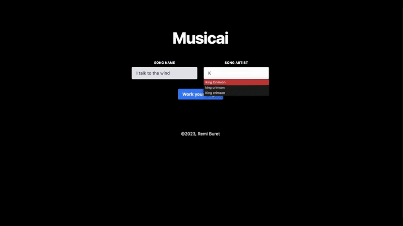

# musicai

## Demo 

## Usage

### API informations
In generate_image.py, add Unsplash API key

In lyrics_classification.py, add Genius API key

In sentiment_analysis_acoustic_properties.py, add Spotify API informations

### Running the app

Create a virtual environement 

python3 -m venv venv

Activate it

.  venv/bin/activate

Install the requirements

python -r requirements.txt

Run the app

python app.py

Note: the first time you run the application, your web-browser will launch in order for you to login to Spotify (does not work with Safari as a default browser)

### Tweaking the ML model

You can generate your own neural network that will classify songs based on acoustic properties

To do so, use the files get-playlist-data.py (training set) and generate-ml-spotify-data-sentiment-analysis.py

The model used to analyse the lyrics is not modifiable and was taken from https://huggingface.co/j-hartmann/emotion-english-roberta-large.

